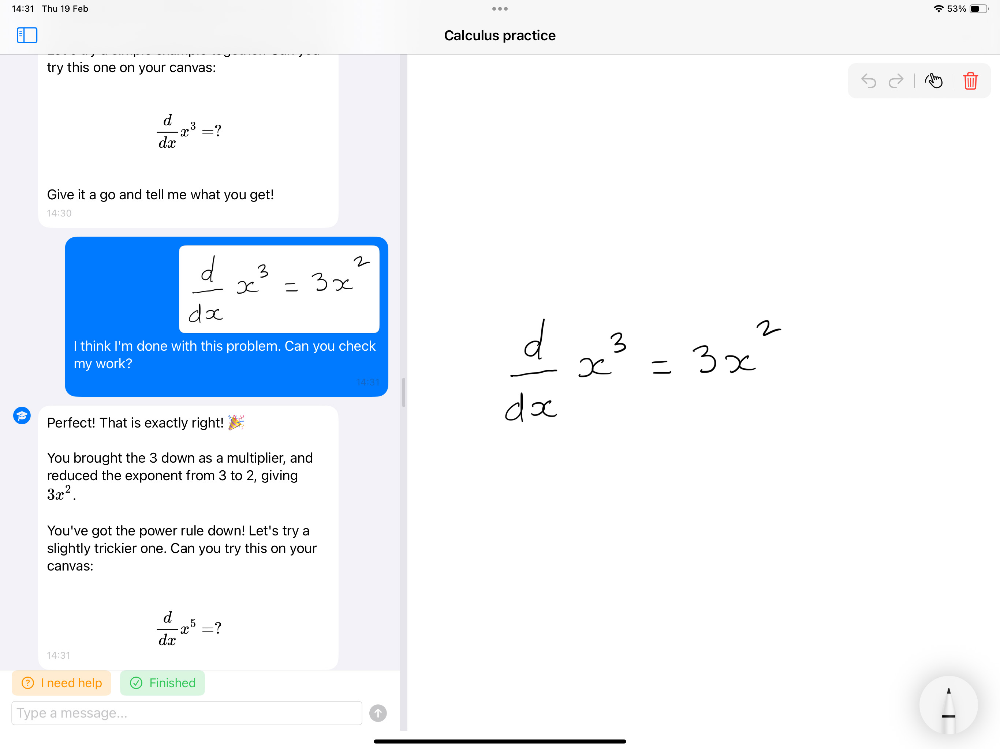

# AI Pencil

An iPad app where kids write math by hand and learn from a Socratic AI tutor that can see their work.



## What it does

Kids write math on a PencilKit canvas with Apple Pencil. When they submit their work, the AI tutor (Claude Sonnet 4.6) sees the handwritten canvas as an image and responds with step-by-step guidance using rendered LaTeX equations. The tutor never gives the full answer directly — it guides students through each step, encouraging them to show their work.

## Features

- **Canvas + Chat split view** — Chat on the left, PencilKit canvas on the right (landscape). Stacked in portrait. Draggable divider between panes.
- **Apple Pencil drawing** — Pencil-only by default, with a toggle for finger drawing. Full PencilKit tool picker (pen, highlighter, eraser, ruler).
- **Vision-powered tutoring** — Canvas snapshots are exported as grayscale JPEG, sent to Claude's vision API alongside the conversation.
- **LaTeX rendering** — Math in the tutor's responses renders as formatted equations via LaTeXSwiftUI/MathJax.
- **Streaming responses** — SSE streaming with real-time text display, cancel button.
- **Quick actions** — "I need help" and "Finished" buttons send predefined prompts with the current canvas state.
- **Session management** — Multiple named sessions with persistent chat history and canvas state via SwiftData.
- **Message editing** — Delete, edit text, or regenerate any message. Deleting a user message cascades to all subsequent messages.
- **Secure API key storage** — Anthropic API key stored in iOS Keychain, masked display in settings.
- **Undo/Redo** — PencilKit's built-in stroke-level undo/redo with toolbar buttons.

## Requirements

- iPad running iOS 17.0+
- Xcode 16.0+
- An Anthropic API key

## Setup

1. Install [XcodeGen](https://github.com/yonaskolb/XcodeGen) if you don't have it:
   ```bash
   brew install xcodegen
   ```

2. Generate the Xcode project:
   ```bash
   xcodegen generate
   ```

3. Open the project:
   ```bash
   open AIPencil.xcodeproj
   ```

4. Select your development team in Signing & Capabilities, then build and run on your iPad.

5. In the app, tap the gear icon and enter your Anthropic API key.

## Project structure

```
AIPencil/
  App/              App entry point, root ContentView
  Models/           SwiftData models (Session, ChatMessage)
  Services/         Anthropic API, Keychain, canvas export, system prompt
  ViewModels/       Chat, Canvas, SessionList view models
  Views/
    Canvas/         PencilKit canvas (UIViewRepresentable) + toolbar
    Chat/           Message bubbles, input bar, streaming indicator
    Workspace/      Adaptive layout, draggable divider
    SessionList/    Sidebar, session rows, new session sheet
    Settings/       API key entry (SecureField + Keychain)
  Utilities/        Constants, image processing (grayscale + resize)
  Extensions/       PKDrawing export, Bundle version helpers
```

## Dependencies

| Package | Purpose |
|---------|---------|
| [SwiftAnthropic](https://github.com/jamesrochabrun/SwiftAnthropic) | Anthropic API client (streaming, vision) |
| [LaTeXSwiftUI](https://github.com/colinc86/LaTeXSwiftUI) | Render LaTeX equations in chat bubbles |

## How images are sent to the API

1. Crop PKDrawing to stroke bounds (+ 20px padding)
2. Convert to grayscale via CIPhotoEffectMono
3. Resize to max 1024px on longest edge
4. Encode as JPEG (quality 0.7, falls back to 0.3 if >5MB)
5. Send as base64 image content block to Claude's vision API

## License

Private project.
